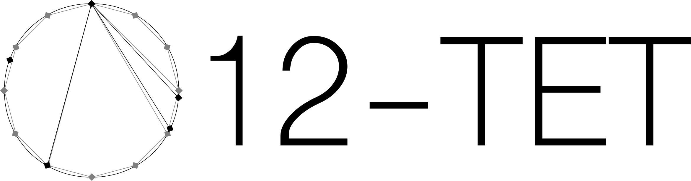

12-TET is a microgrants program supporting:
- Creative and research projects. Interest areas include:
    - Climate and ecology
    - Music, cinema, and the arts
    - Gender and identity
    - Personal and spiritual growth
    - Sustainable and alternative communities
    - Science and technology
    - Homelessness
    - Prison reform
- Cash supplements to alleviate personal emergencies
    - Rent or food
    - Car or home repairs
    - Medical or legal fees
    - Immigration assistance
    - Expenses related to incarceration re-entry

We are a small group of like-minded folks who believe it's as important to give as to receive, and want to promote small-scale donations as a means of achieving greater fluidity between personal income and global outcomes.

Grants are awarded on a rolling basis and are paid via Venmo in one or more tranches based on grant scope and timeline. 12-TET is not a registered non-profit and all grants are personal donations between donor and recipient.

12-TET is a small initiative and our goal is to work with 7-10 applicants in 2022. We apologize if we are unable to assist you at this time and look to expand our program in the coming years.

We will begin accepting new applications in Spring 2022.

<!-- Apply [here](https://forms.gle/TxWhFv6VXYqnmMMX9). -->